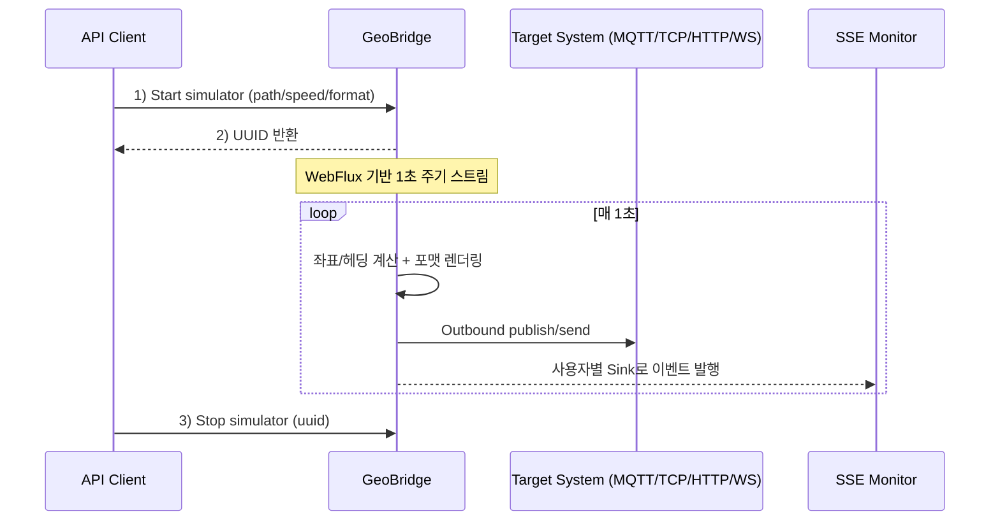
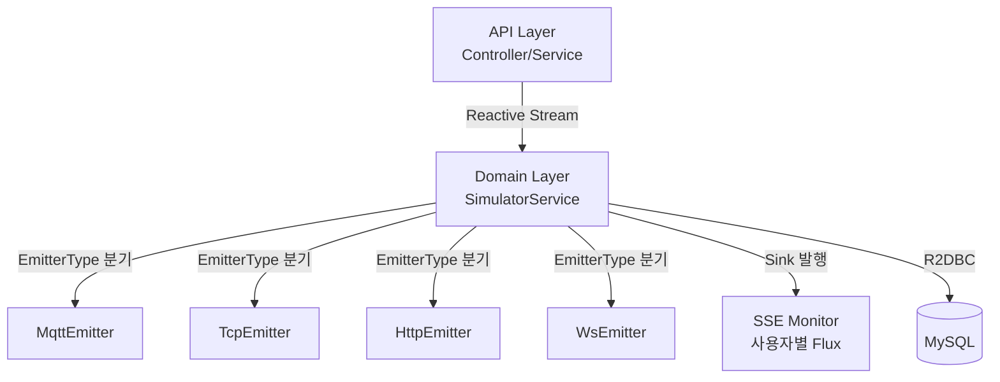

# GeoBridge

**실시간 위치(Geo) 시뮬레이션 데이터를 생성**하고, 대상 시스템으로 **MQTT/TCP/HTTP/WS** 프로토콜로 전송하는 **Spring WebFlux 기반 스트리밍 백엔드**입니다.  
포트폴리오 관점에서 "동시 연결 + 주기 스트림 + 프로토콜 브릿징" 문제를 **Reactive 방식으로 풀어낸** 프로젝트입니다.

## Live Demo

- **Web**: http://geo-bridge.p-e.kr/
- **API Base URL**: http://geo-bridge.p-e.kr

### 데모 계정

```
username: guest
password: guest1234
```

> **데모 환경 제약 안내**  
> 데모 서버는 리소스 보호를 위해 아래 기능이 제한됩니다.
> - **계정 생성**: 신규 계정 생성 불가 (위 게스트 계정 사용)
> - **Outbound 전송(MQTT/TCP/HTTP/WS)**: 외부 타깃 시스템으로의 실제 전송 비활성화
> - **SSE 모니터링**: 인증 후 시뮬레이터 시작 시 정상 동작

---

## 핵심 기능

- **경로 기반 실시간 위치 생성**: `pointList`(위도/경도)와 `speed`를 입력받아 **1초 단위 좌표/헤딩(heading)** 을 계산
- **Multi-Protocol 브릿징**: 생성된 데이터를 **MQTT/TCP/HTTP/WS** 타깃으로 전송 (Outbound)
- **Job 제어**: 시뮬레이터 실행 시 **UUID** 발급 → 실행 중인 Job을 언제든 종료(Kill) 가능
- **SSE 모니터링**: 인증된 사용자별로 **SSE 스트림**을 통해 시뮬레이션 상태/좌표를 실시간 모니터링
- **JWT 인증**: `/api/v1/user/login`에서 토큰 발급 후 보호된 API 접근

## 기술 스택

- **Language**: Java 17
- **Framework**: Spring Boot 3, Spring WebFlux, Spring Security
- **Integration**: Spring Integration (MQTT/IP), Eclipse Paho MQTT v5
- **DB**: MySQL + Spring Data R2DBC (Reactive)
- **Build**: Gradle
- **Geo**: JTS / GeoTools / Proj4j

---

## 빠른 시작 (Local)

> 기본 포트: `9000` (application.yml)

### Prerequisites

- Java 17
- MySQL (로컬에서 실행)

### DB 설정

`src/main/resources/application-local.yml`의 R2DBC 접속 정보를 로컬 환경에 맞게 수정합니다.

### 실행

```bash
./gradlew bootRun --args="--spring.profiles.active=local"
```

---

## 대표 API

- **Local Base URL**: `http://localhost:9000`
- **Demo Base URL**: `http://geo-bridge.p-e.kr`

### 1) 회원 생성 (공개)

`POST /api/v1/user/info`

```bash
curl -X POST "http://localhost:9000/api/v1/user/info" \
  -H "Content-Type: application/json" \
  -d '{"username":"demo","password":"demo1234"}'
```

**응답 예시**

```json
{
  "userId": 1,
  "username": "demo"
}
```

**에러 예시**

| 상황 | HTTP Status | 응답 |
|------|------------|------|
| 이미 존재하는 username | `409 Conflict` | `{"message": "이미 존재하는 사용자입니다."}` |
| 필수 필드 누락 | `400 Bad Request` | `{"message": "username 또는 password가 비어있습니다."}` |

---

### 2) 로그인 (공개) → JWT 발급

`POST /api/v1/user/login`

```bash
curl -X POST "http://localhost:9000/api/v1/user/login" \
  -H "Content-Type: application/json" \
  -d '{"username":"demo","password":"demo1234"}'
```

**응답 예시**

```json
{
  "token": {
    "grantType": "Bearer",
    "accessToken": "eyJhbGciOiJIUzI1NiJ9..."
  }
}
```

이후 요청은 `Authorization: Bearer <accessToken>` 헤더를 포함합니다.

**에러 예시**

| 상황 | HTTP Status | 응답 |
|------|------------|------|
| 잘못된 비밀번호 | `401 Unauthorized` | `{"message": "아이디 또는 비밀번호가 올바르지 않습니다."}` |
| 존재하지 않는 계정 | `401 Unauthorized` | `{"message": "아이디 또는 비밀번호가 올바르지 않습니다."}` |

---

### 3) 시뮬레이터 시작 (보호)

`POST /api/v1/emitter/simulator` → `uuid(String)` 반환

```bash
curl -X POST "http://localhost:9000/api/v1/emitter/simulator" \
  -H "Content-Type: application/json" \
  -H "Authorization: Bearer <accessToken>" \
  -d '{
    "type":"MQTT",
    "host":"tcp://localhost:1883",
    "name":"demo-sim",
    "topic":"track.demo",
    "hostId":"demo",
    "password":"demo",
    "pointList":[
      {"lat":37.5665,"lon":126.9780},
      {"lat":37.5670,"lon":126.9784}
    ],
    "speed":10.0,
    "speedUnit":"M_S",
    "cycle":1,
    "format":"{\"lat\":${lat},\"lon\":${lon},\"heading\":${heading}}",
    "parameter":{"fbctnNo":"DJI"}
  }'
```

> `type`은 `MQTT` | `TCP` | `HTTP` | `WS` 중 하나입니다.  
> `format` 필드의 `${lat}`, `${lon}`, `${heading}`은 런타임에 계산된 값으로 치환됩니다.

**응답 예시**

```json
{
  "uuid": "a1b2c3d4-e5f6-7890-abcd-ef1234567890"
}
```

**에러 예시**

| 상황 | HTTP Status | 응답 |
|------|------------|------|
| 인증 토큰 없음/만료 | `401 Unauthorized` | `{"message": "인증이 필요합니다."}` |
| `pointList` 2개 미만 | `400 Bad Request` | `{"message": "pointList는 최소 2개 이상이어야 합니다."}` |
| 타깃 연결 실패 | `502 Bad Gateway` | `{"message": "타깃 시스템에 연결할 수 없습니다."}` |

---

### 4) 시뮬레이터 종료 (보호)

`DELETE /api/v1/emitter/simulator?uuid=<uuid>`

```bash
curl -X DELETE "http://localhost:9000/api/v1/emitter/simulator?uuid=<uuid>" \
  -H "Authorization: Bearer <accessToken>"
```

**에러 예시**

| 상황 | HTTP Status | 응답 |
|------|------------|------|
| 존재하지 않는 uuid | `404 Not Found` | `{"message": "해당 Job을 찾을 수 없습니다."}` |
| 이미 종료된 Job | `409 Conflict` | `{"message": "이미 종료된 Job입니다."}` |

---

### 5) SSE 모니터링 (보호)

`GET /api/v1/emitter/client/monitoring/coords` (SSE)

```bash
curl -N "http://localhost:9000/api/v1/emitter/client/monitoring/coords" \
  -H "Accept: text/event-stream" \
  -H "Authorization: Bearer <accessToken>"
```

**스트림 이벤트 예시**

```
data: {"uuid":"a1b2c3d4","lat":37.5667,"lon":126.9782,"heading":42.3,"timestamp":1710000001}

data: {"uuid":"a1b2c3d4","lat":37.5668,"lon":126.9783,"heading":42.5,"timestamp":1710000002}
```

---

## 아키텍처 & 데이터 플로우





---

## 기술 선택 (의도)

- **Spring WebFlux**  
  장기 연결/주기 스트림(1초 단위 push)이 많은 도메인에서, 스레드 점유를 최소화하고 이벤트 루프 기반으로 동시성을 예측 가능하게 운영하기 위해 채택했습니다.

- **R2DBC(MySQL)**  
  전체 파이프라인을 Reactive로 유지하여 DB I/O가 병목으로 전환되는 것을 방지하고, 동일한 실행 모델 안에서 backpressure/비동기 흐름을 유지하기 위해 선택했습니다.

- **Spring Integration + 프로토콜 분리(EmitterType)**  
  프로토콜별 클라이언트 구현을 `EmitterType` 열거형 기반으로 분리해, 새 프로토콜 추가 시 기존 코드를 건드리지 않고 확장할 수 있도록 설계했습니다.

---

## 프로젝트 구조

```
src/main/java/com/geo/bridge/
├── api/
│   ├── controller/       # REST Controller (user, emitter)
│   └── service/          # API 요청 처리 및 도메인 서비스 위임
├── domain/
│   ├── emitter/          # 시뮬레이터 Job 관리 및 좌표/헤딩 계산 코어 로직
│   ├── integration/      # 프로토콜별 Emitter 구현 (MQTT/TCP/HTTP/WS)
│   └── user/             # 사용자 도메인 (Entity, Repository)
└── global/
    ├── security/         # JWT 발급/검증, WebFlux Security 필터 체인
    └── config/           # WebFlux, R2DBC, Spring Integration 설정
```

---

## 테스트

```bash
./gradlew test
```