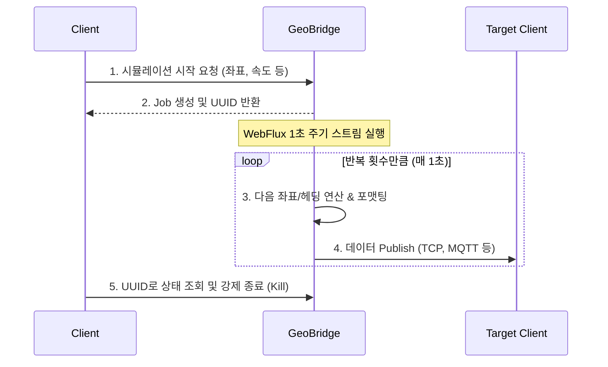

# 🌉 GeoBridge (Real-time Geospatial Data Simulator)

## 📌 Project Overview
**GeoBridge**는 입력된 경로(좌표 리스트)를 기반으로 이동 객체의 실시간 위치 데이터를 계산하고, 다양한 클라이언트 프로토콜(TCP, MQTT, WebSocket, HTTP)로 스트리밍하는 **반응형(Reactive) 시뮬레이터**입니다. 

주어진 속도에 맞춰 1초 단위의 중간 좌표와 벡터(방향/헤딩)를 실시간으로 연산하며, 동적인 데이터 포맷팅을 통해 다양한 도메인(드론 관제, 차량 트래킹 등)의 클라이언트와 연동할 수 있도록 설계되었습니다.

## 🚀 Key Features
* **Multi-Protocol Streaming:** 클라이언트의 요구사항에 맞춰 TCP, MQTT, WebSocket, HTTP 등 다양한 통신 프로토콜 지원.
* **Real-time Vector Calculation:** 출발지와 목적지 좌표, 속도를 기반으로 1초 단위의 중간 좌표 및 방향(Heading) 실시간 연산.
* **Dynamic Payload Binding:** 위도, 경도, 속도, 고도 및 추가 파라미터(Additional Parameters)를 클라이언트가 원하는 포맷으로 동적 바인딩.
* **Job Control System:** 시뮬레이터 실행 시 고유 UUID를 발급하여, 개별 시뮬레이션의 상태 모니터링 및 실시간 강제 종료(Kill) 제어 가능.

## 🛠 Tech Stack
* **Framework:** Spring Boot, Spring WebFlux
* **Database:** R2DBC (Reactive Relational Database Connectivity)
* **Language:** Java / Kotlin (사용하신 언어 작성)
* **Build Tool:** Gradle / Maven (사용하신 툴 작성)

## 🏗 Architecture & Data Flow

1. **Request:** 클라이언트가 경로(좌표 리스트), 속도, 고도, 반복 횟수, 타겟 프로토콜 정보를 포함하여 시뮬레이션 요청.
2. **Init Job:** GeoBridge가 시뮬레이션 Job을 생성하고 **UUID를 반환**.
3. **Calculate & Format:** WebFlux 플로우 내에서 1초마다 다음 좌표와 벡터를 계산하고 지정된 포맷으로 페이로드 생성.
4. **Publish:** 타겟 클라이언트(TCP/MQTT 등)로 1초마다 데이터 전송.
5. **Control:** 부여받은 UUID를 통해 실행 중인 시뮬레이션을 모니터링하거나 중단.

## 🎯 Core Technical Decisions
* **Why Spring WebFlux? (장기 연결 최적화)**
  * **도메인 특성:** GeoBridge는 다수의 클라이언트(TCP, MQTT, WS 등)와 커넥션을 맺고, 각 시뮬레이터가 종료될 때까지 **1초 단위로 끊임없이 위치 데이터를 푸시(Push)**해야 하는 특성을 가집니다.
  * **문제 인식:** 기존 Spring MVC 모델에서는 이러한 장기 연결이 늘어날수록, I/O 대기 상태의 스레드가 누적되어 메모리 점유 및 컨텍스트 스위칭 비용이 기하급수적으로 증가할 우려가 있었습니다.
  * **해결 및 기대효과:** 이를 해결하기 위해 적은 수의 스레드로 다중 연결을 효율적으로 제어하는 **Netty 기반의 이벤트 루프(Event Loop) 아키텍처**를 채택했습니다. 결과적으로 수많은 시뮬레이터가 동시에 동작하는 환경에서도 서버 리소스(CPU, Memory)를 예측 가능하게 사용하고, 안정적인 동시성 처리가 가능하도록 설계했습니다.
* **R2DBC 도입**
  * 전체 애플리케이션의 Reactive Stream 생태계를 유지하기 위해, DB 접근 계층 역시 비동기/논블로킹으로 동작하는 R2DBC를 채택하여 병목 현상을 방지했습니다.